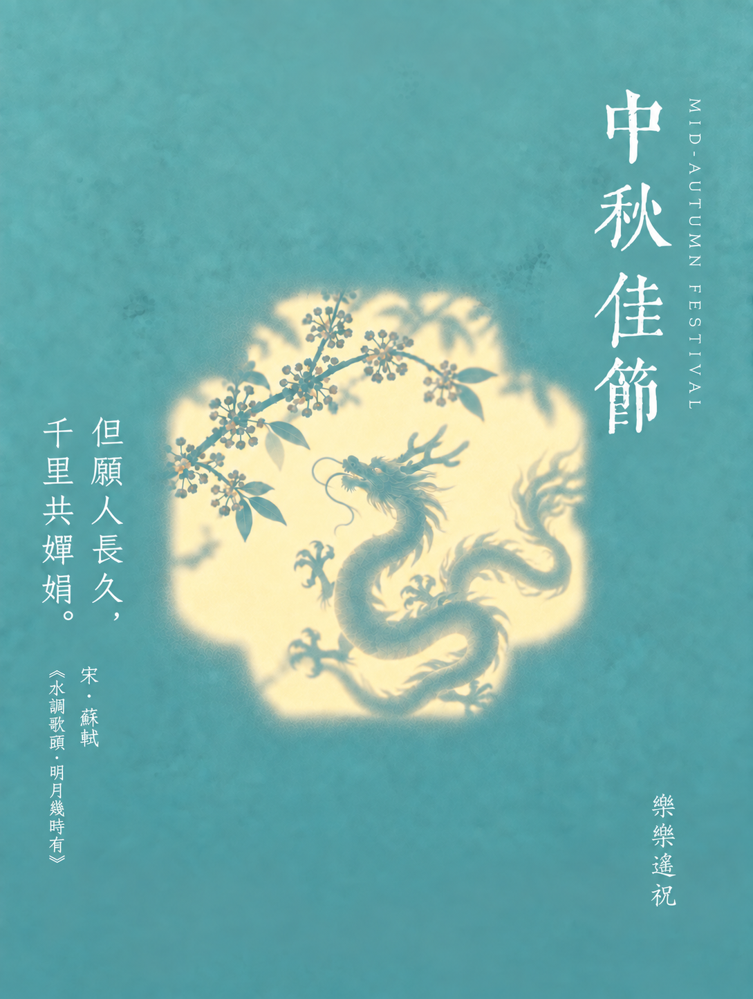

# Glow Poster · 中秋光影海报

用传统色、柔光花窗和窗内投影，生成带繁体竖排文字的中秋祝福海报。生肖可选，署名可选，未指定的视觉元素自由随机组合。

An agent Skill for Mid-Autumn greeting posters: translucent window shadows, traditional Chinese typography, independent random combinations, optional zodiac subjects and a personal signature.

## 海报示例

<table>
  <tr>
    <td align="center"><br>龙 · 雾青蓝 · 海棠四瓣窗</td>
    <td align="center"><br>兔 · 青绿 · 海棠四瓣窗</td>
  </tr>
  <tr>
    <td align="center"><br>兔 · 杏黄 · 折扇窗</td>
    <td align="center"><br>鼠 · 湖蓝 · 折扇窗</td>
  </tr>
</table>

*四张均为 AI 生成的繁体竖排成图，展示不同组合及「樂樂遙祝」署名。示例名称不是默认署名；字体外观为模型近似，不表示精确加载了字体文件。*

## 如何使用

把 [glow-poster](glow-poster/) 文件夹注册到支持本地 Skill 的 Agent，入口是 [SKILL.md](glow-poster/SKILL.md)。使用者需要有可调用的图片生成工具；本仓库不提供图片服务、API 密钥或付费接口。

可以直接说：

> 生成一张中秋祝福海报。

> 生成一张生肖是鼠的中秋海报，署名清和。

> 生成一张杏黄色、折扇窗的中秋海报，不署名。

- **没提供生肖**：从八组经典中秋意象随机选择，不追问生肖。
- **提供生肖**：固定该生肖，随机搭配配景、诗句、配色和窗形。
- **开始前询问署名**：提供最终显示名称后，在右下角小字竖排「名称＋遙祝」；明确不署名时留白。同一任务已确认的选择会沿用。
- **自由组合**：不设默认内容组合；指定的选项固定，其余独立随机。随机结果可能重复；种子可复现选择。
- **版式**：默认繁体竖排、标题「中秋佳節」，横排为可选模式。

## 组合库

| 内容 | 数量 |
|---|---:|
| 古典诗句，含完整出处 | 20 |
| 数字设计配色 | 6 |
| 花窗轮廓 | 5 |
| 经典中秋意象 | 8 |
| 十二生肖 | 12 |
| 生肖配景 | 8 |

详细清单见 [catalog.md](glow-poster/references/catalog.md)。经典模式有 4,800 个参数组合，每个生肖也有 4,800 个；这是参数空间，不是已生成或逐张验收的图片数量。色名为设计描述，不是唯一历史色标。

## 安装与命令行

需要 Python 3.10 或更新版本。`plan.py` 仅使用标准库；本地横排排字与验证器另需 Pillow、NumPy、fontTools。建议在仓库外建立虚拟环境。

```sh
git clone https://github.com/tanglele110-hash/glow-poster-skill.git
python -m pip install -r glow-poster-skill/glow-poster/requirements.txt
```

将克隆目录中的 `glow-poster` 子目录链接到 Agent 的 Skill 目录；不要只复制 `SKILL.md`，它依赖同目录的脚本、字体和参考资料。注册方式取决于宿主，不需要设置本仓库专属环境变量。

下列命令在仓库根目录运行；输出放在仓库外。只有用户已明确选择不署名时才传 `--no-signature`。

```sh
# 经典中秋模式：不需要生肖，全部内容随机
python glow-poster/scripts/plan.py --no-signature --out-dir ../poster-classic

# 固定生肖，署名使用最终显示名称；不重复写「遙祝」
python glow-poster/scripts/plan.py --zodiac 鼠 --signature "清和" --out-dir ../poster-rat

# 指定部分选项，其余随机；--seed 可选
python glow-poster/scripts/plan.py --color c04 --window w05 --no-signature --seed 42 --out-dir ../poster-fan

# 仅查看素材目录
python glow-poster/scripts/plan.py --list
```

规划器只产生 `plan.json`、`prompt.txt`、`text.json`，**不会生成 PNG**。Agent 读取提示与两张参考图，调用宿主图片工具生成完整竖排海报，再逐字检查标题、诗句、出处和署名。

横排模式使用 `--layout horizontal`，输出 `compose.json`。先用图片工具生成无字背景并保存为配置指定的 `background.png`，再执行：

```sh
python glow-poster/assets/compose.py ../poster-horizontal/compose.json
```

横排排字使用真实字体文件。`compose.py` 不支持对完整竖排成图再次排字。输出默认不覆盖旧文件，缺字、越界、光斑侵占文字区或严重对比度不足会报错。

## 验证

```sh
python glow-poster/scripts/verify.py --out-dir ../glow-poster-verification
```

使用新的输出目录。验证覆盖目录组合、随机选择、生肖别名、署名输入、真实字体排字及失败边界；自动检查不替代图像内容与中文字符的目检。

## 能力边界

- 图片模型不保证逐像素 HEX 色准、精确尺寸或精确加载齐伋体；交付必须记录实际尺寸并检查字形。
- 浅色背景上的白字需要目检。排字脚本发现严重低对比度时会停止，不擅自加深用户选定的底色。
- 任意名称的繁简转换由 Agent 根据用户要求处理；脚本保留最终输入名称。长署名须检查空间，横排脚本不删字来强行适配。
- 本地楷体是可选项，不随包分发操作系统字体；跨平台可显式指定有使用许可的字体。
- 规划及排字脚本不访问网络。图片生成由所选宿主服务处理，上传参考图前应遵循该服务的条款。

## 授权与来源

项目代码与原创说明采用 [MIT](LICENSE)。三套字体分别保留 **SIL OFL 1.1**，不由 MIT 替代；不包含系统楷体、原始参考截图、运行日志或认证文件。`docs/examples/` 中的四张署名成图经提供者明确同意公开展示，署名仅属于这些示例。

古典诗句只收录原文摘句和出处，不包含现代译文或赏析。参考图为 AI 生成，原始参考材料的发布权已由提供者确认；不承诺 AI 输出在所有法域均具有排他版权，也不保证任何下游用途自动无侵权风险。

见 [第三方声明](THIRD_PARTY_NOTICES.md)、[来源说明](glow-poster/references/sources.md) 和 [发布检查](RELEASE_CHECK.md)。

## English quick start

Register the `glow-poster/` directory with your agent, then ask for a Mid-Autumn greeting poster. Zodiac is optional. The agent asks for a signature choice before generation and independently randomizes unspecified content axes. Python produces plans; an image-capable host produces the artwork. Default vertical typography is generated as part of the image; optional horizontal composition uses bundled font files. Preserve each font's OFL license when redistributing.
