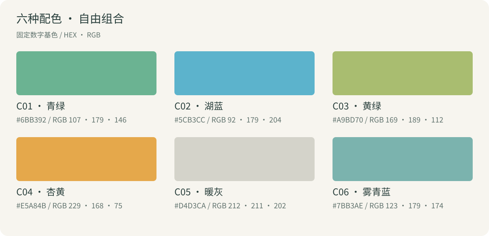
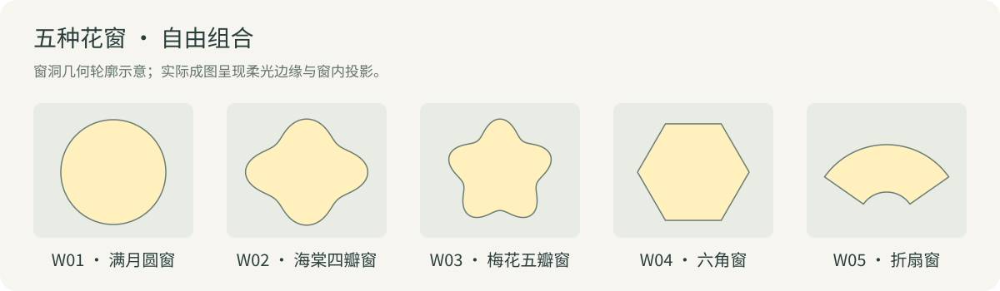

# Glow Poster · 中秋光影海报

## 简介

用传统色、柔光花窗与中秋意象，生成繁体竖排祝福海报。支持十二生肖和个人署名，诗句、颜色、窗形与配景可自由组合。

## 海报示例

<table>
  <tr>
    <td align="center"><br>龙 · 雾青蓝 · 海棠四瓣窗</td>
    <td align="center"><br>兔 · 青绿 · 海棠四瓣窗</td>
  </tr>
  <tr>
    <td align="center"><br>兔 · 杏黄 · 折扇窗</td>
    <td align="center"><br>鼠 · 湖蓝 · 折扇窗</td>
  </tr>
</table>

## 如何使用

安装后，对 Agent 说：

> 生成一张中秋祝福海报。

> 生成一张生肖是鼠的中秋海报，署名清和。

> 生成一张杏黄色、折扇窗的中秋海报，不署名。

- **生肖可选**：不指定时，从八组经典中秋意象中选择。
- **署名可选**：开始时询问；提供名称后，在右下角竖排「名称＋遙祝」。
- **自由组合**：指定项固定，其余独立随机，没有默认组合。
- **繁体竖排**：标题为「中秋佳節」，齐伋体为首选风格；也支持横排。

## 组合库

| 元素 | 可选内容 |
|---|---|
| 诗句 | 20 组古典诗句，附作者与出处 |
| 配色 | 6 种 |
| 花窗 | 5 种 |
| 经典意象 | 玉兔·桂枝、嫦娥·桂树、蟾蜍·月轮、月饼·茶盏、灯笼·桂影、桂酒壶·桂花瓣、莲瓣瓜·供盘、诗卷·月光 |
| 生肖 | 十二生肖，搭配 8 种配景 |

### 配色



### 花窗



各项可自由搭配，完整清单见 [组合目录](glow-poster/references/catalog.md)。色名为设计描述，色值以图中色号为准。

## 如何安装

```sh
git clone https://github.com/tanglele110-hash/glow-poster-skill.git
```

将仓库内的 `glow-poster/` 文件夹复制或链接到 Agent 的 Skill 目录，入口为 [SKILL.md](glow-poster/SKILL.md)。需要 Python 3.10+，以及可调用图片生成工具的 Agent。

如需本地横排排字或运行验证器，再安装依赖：

```sh
python -m pip install -r glow-poster-skill/glow-poster/requirements.txt
```

## 能力边界

- 图片模型可能出现错字、色差和尺寸偏差，成图需目检。
- 竖排字体由模型近似呈现；横排排字可使用真实字体文件。
- Python 脚本负责组合规划和可选排字，图片生成由宿主工具完成。

## 授权与来源

代码与原创说明采用 [MIT](LICENSE)，三套字体保留各自的 **SIL OFL 1.1** 许可。参考图与海报示例为经授权公开的 AI 生成图片。

详见 [第三方授权](THIRD_PARTY_NOTICES.md) 与 [资料来源](glow-poster/references/sources.md)。
